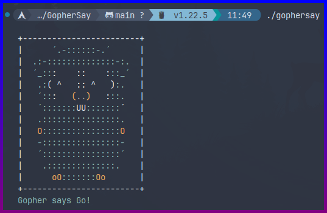

# GopherSay

A fun CLI tool that I wrote in my journey of learning Go.



## Usage

### Linux
```
git clone https://github.com/DatCodeMania/GopherSay.git
cd GopherSay
go build -o GopherSay .
./GopherSay "Message"
```

### Windows
```
git clone https://github.com/DatCodeMania/GopherSay.git
cd GopherSay
go build -o GopherSay.exe .
./GopherSay "Message"
```
## Other

Inspired by [`cowsay`](https://github.com/piuccio/cowsay)

ASCII art from codeacademy.

Licensed under the [MIT License](LICENSE)